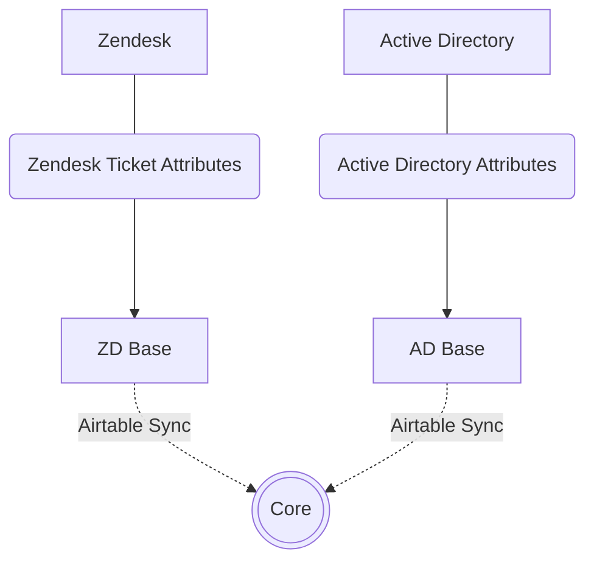

## Flow Airtable

```mermaid
flowchart TD
	group1[Active Directory]--- AD_Atrributes(Active Directory Attributes) ---> AD_AT_BASE[AD Base]
	group2[Zendesk]--- ZD_Attributes(Zendesk Ticket Attributes) ---> ZD_AT_BASE[ZD Base]
	ZD_AT_BASE -.-> |Airtable Sync| Core(((Core)))
	AD_AT_BASE -.-> |Airtable Sync| Core

class AD_Atrributes internal-link;
class ZD_Attributes internal-link;
```
