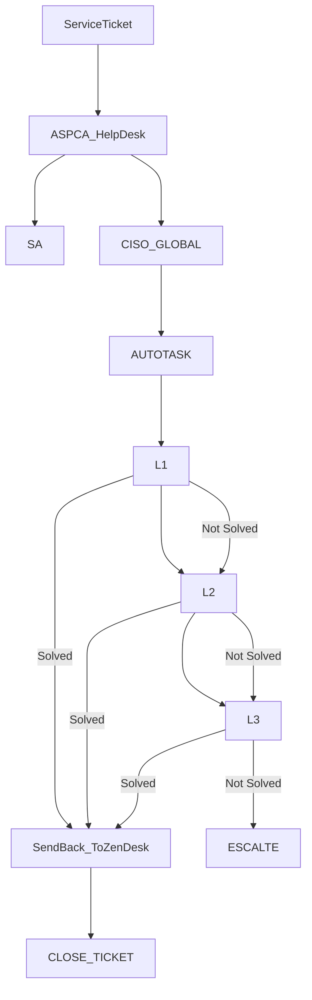

> [!info]+
>Attendees: 

## Summary

## Notes

Types of Tickets to CISO

### ASPCA Tickets
1. E-Discovery (Content Search)
2. 

### CISO Tickets
1. Distribution List
2. Vendors Escalation
3. SA Queue Tickets - General Tickets

## Action Items
