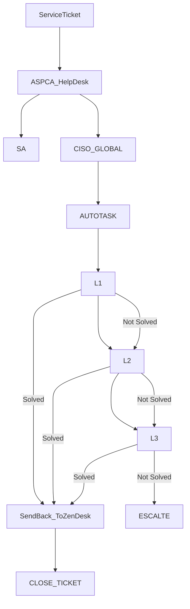

> [!info]+
>Attendees: 

## Summary

## Notes

Types of Tickets to CISO

### ASPCA Tickets
1. Legal E-Discovery (Content Search across Apps)
2. SPAM
3. Domain Management (DNS/Registrar/SSL)
4. Okta Application Administrator
5. Project Work ---> CISO if needed

### CISO Tickets
1. Distribution List
2. Vendors Escalation
	1. ISP
	2. Microsoft
	3. Fortinet Support
	4. Meraki Support
3. SA Queue Tickets - General Tickets
4. Server Certificate Renewal
5. Okta Provisioning??
6. Server Monitoring & Remediation
7. Patching 
	1. Off Hours Patching
8. Networking Monitoring
9. Backups

## Action Items
