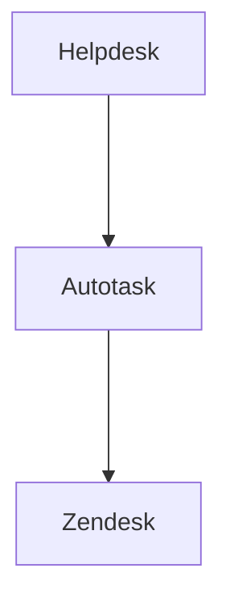

> [!info]+
>Attendees: 

## Summary
1. Zendesk tickets assigned to CISO
	1. Helpdesk Management to send tickets over to CISO (Help Desk Managent)
		1. [ ] Who should keep the ticket on our side? Is it the person who assigns it to the ticket or does SA
	2. Zendesk sends over the ticket to AutoTask
	3. [ ] As the tech does the work AutoTask sends the info back to Zendesk
	4. Once the Autotask ticket is closed, it would come back to Zendesk with particular **closure code**

## Notes
- **Can we have Zendesk make reply from AutoTask email become internal automatically?**

	* ~~Maria looking at contributing role~~
	* 

## Action Items
- [ ] How does CISO Global see the internal notes on our Zendesk Side? Only public comments are avaliable
- If we give them a license they would get internal notes